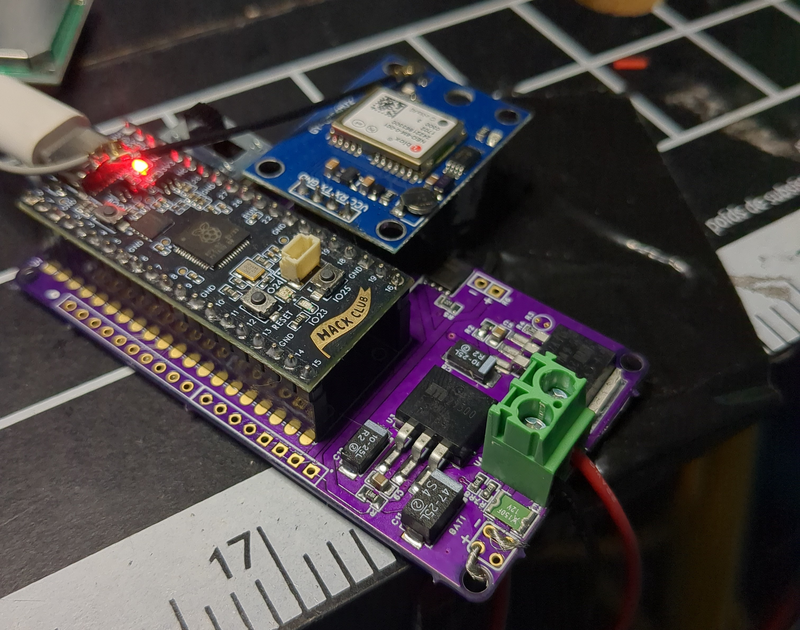
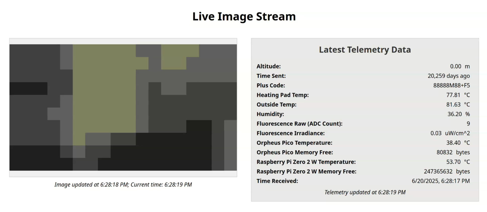
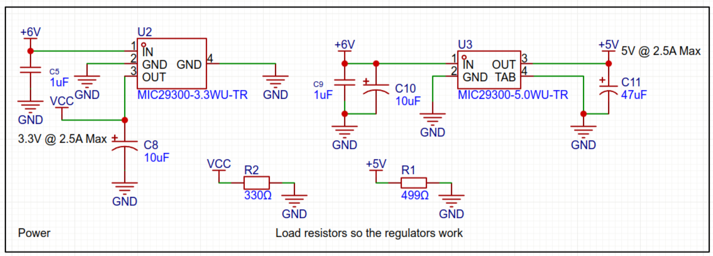

# StratoSpore

  

StratoSpore is a high altitude balloon payload which attempts to detect biological altitude utilizing chlorophyll fluorescence.

You can read my writeup about StratoSpore on my [blog](https://radi8.dev/blog/stratospore/).

## The Experiment

- Measure the fluorescence of chlorophyll in algae using photodiodes and light  
- Measure other data (e.g. altitude, geographical location, temperature, UV exposure, etc.) using sensors, and correlate the data with the spectral sensor output

## The Hypothesis

Chlorophyll fluorescence in algae will exhibit measurable changes in intensity or characteristics that correlate with variations in altitude and other environmental factors (temperature, UV exposure, etc.).

When exposed to specific wavelengths of light, chlorophyll fluoresces in a telltale red signature. In fact, a very common high and middle school experiment known as bloody chlorophyll, leverages this effect to produce a haunting blood like color from the otherwise green plant slurry.

Chlorophyll fluorescence usually peaks around 680-685 nm. Using a bandpass filter, we selectively let light into a viewing chamber. This selection yields us a readable level of clean fluorescence which can be measured using an optical sensor made up of photodiodes and read using the Raspberry Pi Pico 2’s (or Orpheus Pico) I2C interface. Previously, we planned on just using a normal photodiode, but found an Integrated Circuit that would be much less expensive and easier to use.

---

## **Hardware and Electrical**

The payload will consist of 3 PCBs, which will collect, process, and transmit data. We plan on using a Raspberry Pi Zero 2 WH for the main data recording and transmission. If possible, we hope to transmit all recorded data live over a 915Mhz LoRa signal. All sensor data will be collected by a Raspberry Pi Pico 2 (or Orpheus Pico) before being fed into the Pi Zero 2 WH over UART.

## **Data Collection and Processing**

The Raspberry Pi Pico 2 will be responsible for interfacing with various sensors, including:

- [x] GPS module for geographical location  
- [x] Temperature, barometric pressure, and humidity sensor  
- [x] UV exposure sensor  
- [x] Photodiode for chlorophyll fluorescence measurement  
- [x] Thermocouple for checking heating pad temperature  
- [x] Temperature sensor for algae

### BME280 Circuit

To have data we can correlate with the fluorescence levels, we will be using a **BME280** to gather certain environmental properties including temperature, humidity, and barometric pressure. It will communicate with the Raspberry Pi Pico 2 (or Orpheus Pico) via its I2C interface.

Despite designing a PCB for the BME280, we were unable to get it to work and decided to use a BME280 breakout board from SparkFun instead.

### UV Sensor

We are using Adafruit’s Analog UV Light Sensor Breakout to measure UV index using a photodiode. Originally, we made our own circuit using Adafruit’s schematics, but later decided to save the money by just buying the breakouts. It will be connected to the Raspberry Pi Pico 2’s (or Orpheus Pico) ADC. It will measure UV light in the 240-370 nm range which covers UVB and most of the UVA spectrum. UV index will be measured by dividing the output voltage by 0.1. If the output voltage is 0.5V, the UV index is 5\. It will be directly soldered onto the sensor board, mounted outside the payload.

### Fluorescence Measurement Board

A PCB will be mounted to the flask of algae so we can receive the most accurate reading of Relative Fluorescence Units. An **AS7343** sensor is being used because it can capture visible light at 690 nm, which is close to the peak for chlorophyll fluorescence. It will communicate with the Raspberry Pi Pico 2 (or Orpheus Pico) over I2C.  

Despite designing a PCB for the AS7263, we were unable to get it to work and decided to use a AS7343 breakout board from SparkFun instead.

### GPS

We are using a Neo 6M GPS breakout from Amazon.

Data from these sensors will be collected at regular intervals and timestamped. The Pico 2 (or Orpheus Pico) will then process this data and transmit it to the Raspberry Pi Zero 2 WH via UART.

The Raspberry Pi Zero 2 WH will act as the central hub for data logging and transmission. It will:

- [x] Receive data from the Pico 2 (or Orpheus Pico) over UART, I2C, and ADC  
- [x] Store the data locally  
- [x] Attempt to transmit the data live over LoRa  
- [x] Perform additional data analysis and prediction

All data is logged with MongoDB, and viewed from a custom dashboard.

## **Power Supply**

The payload required a reliable power source. We used:

- [x] 4x Energizer Ultimate Lithium AA Batteries

A power management circuit will be essential to regulate the voltage and ensure a stable power supply to all components. As we require many components, we must make two voltage rails so we can provide the correct power to the correct components. We will have the following voltage rails:

- [x] \+5V \- **for various components including the Raspberry Pi Zero 2 WH**  
      - A regulator is used for simplicity and cost sake  
- [x] \+3.3V \- **for various sensors**  
      - A regulator is also used

## **Enclosure**

The payload is housed in a protective enclosure. The enclosure must:

- [x] Be lightweight (ish)
- [x] Be durable enough to withstand the conditions of high altitude flight  
- [x] Protect the electronics from temperature extremes and UV radiation  
- [x] Mount a sensor board on the top  
- [x] Have a window to let light in  
- [x] Have a camera to take pictures

### The Window

We will need light to come in through an acrylic window so our algae can be exposed to light to make it photosynthesize and fluoresce. In front of the window will also be a Raspberry Pi Camera Module 2 to take pictures. Images captured will be heavily compressed using a custom algorithm.

The box will contain the mainboard with the Pico (or Orpheus Pico) and power supplies, a Raspberry Pi Zero 2 W with a 915 Mhz LoRa module, the camera, fluorescence sensor (+ temperature), and the sensor board mounted on the top of the box.  

## Current Tasks

| Description | Status |
| :---- | :---- |
| Finish Power Supply Design | Complete |
| Order PCBs and Assemble | Complete |
| Create Firmware | Complete |
| Order algae and grow more of it | Complete |
| Test everything | Complete |
| [Launch balloon](https://apex.hackclub.com) | Complete |
| Analyze data | Complete |

## References

Fluorescence. [https://www.esa.int/Applications/Observing\_the\_Earth/FutureEO/FLEX/Fluorescence](https://www.esa.int/Applications/Observing_the_Earth/FutureEO/FLEX/Fluorescence). Accessed 22 Mar. 2025\.

## Acknowledgements

Thank you to the [Apex](https://apex.hackclub.com) team for supporting this project and setting up this event!

Thank you to [OSH Park](https://oshpark.com) for generously sponsoring manufacturing of all custom PCBs!

Thank you to [Sean Wallace](https://seanjw.com/) for creating the wordmark/logo for StratoSpore!
